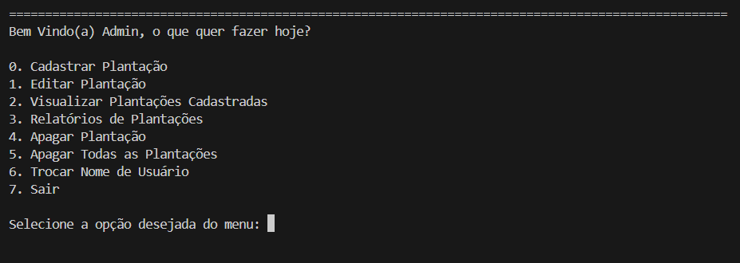

# 🌱 Mini Sistema de Manuseio de Plantações

Sistema CLI em Python para gestão de plantações agrícolas — controle de ciclo de plantio/colheita, status de produção e relatórios, com persistência local em JSON.

> Projeto desenvolvido com fins de estudo, aplicando lógica de programação, modularização, manipulação de datas e persistência de dados usando apenas a biblioteca padrão do Python.


---

## 📷 Print do Terminal CLI para Demonstração



---

## 📖 Sobre o Projeto

Este projeto simula o dia a dia de uma pequena operação agrícola: cadastro de plantações, acompanhamento automático do tempo até a colheita, classificação de status (Agendada / Em andamento / Concluída) e geração de relatórios simples — tudo via terminal, sem dependências externas.

O objetivo principal foi consolidar fundamentos de Python de forma prática: estruturação de código em módulos, regras de negócio baseadas em datas, tratamento de exceções e persistência de dados em arquivo.

---

## ✨ Funcionalidades

**Plantações**
- Cadastro, edição, visualização e remoção de plantações
- Cálculo automático do tempo restante até a colheita
- Classificação automática de status (Agendada, Em andamento, Concluída)
- Listagem das próximas colheitas

**Usuário**
- Cadastro e alteração de nome de usuário

**Dados**
- Persistência local em arquivos JSON (sem banco de dados externo)

**Interface**
- Menu interativo via terminal (CLI)

---

## 🛠️ Tecnologias

Apenas bibliotecas padrão do Python — nenhuma dependência externa:

| Biblioteca | Uso |
|---|---|
| `datetime` | Cálculo e comparação de datas |
| `json` | Leitura e escrita de dados persistidos |
| `os` | Limpeza de tela e manipulação de caminhos |

---

## 🧠 Conceitos Aplicados

- Estruturas de dados (`list`, `dict`)
- Modularização e organização de código em funções e módulos
- Tratamento de exceções (`try/except`)
- Regras de negócio baseadas em datas
- Entrada e saída de dados via terminal
- Persistência de dados em JSON
- Estilo procedural / funcional

---

## 📂 Estrutura do Projeto

```
├── main.py
├── README.md
├── assets/
│   └── exemplo1.png
├── src/
│   ├── utils.py
│   ├── usuario.py
│   ├── plantacoes.py
│   └── auxiliares.py
└── data/
    ├── plantacoes.json
    ├── usuarios.json
    └── sementes.json
```

---

## ▶️ Como Executar

**Pré-requisitos:** Python 3 instalado

```bash
# Clone o repositório
git clone https://github.com/seu-usuario/nome-do-repositorio.git

# Acesse a pasta do projeto
cd nome-do-repositorio

# Execute
python main.py
```

---


## 📝 Observações

- Sistema 100% offline, com dados armazenados localmente
- Projeto com finalidade educacional
- Estrutura pensada para facilitar manutenção e evolução